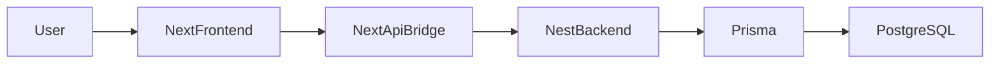

Generated from repository inspection.
Repository revision: HEAD
Generated date: 2026-08-02T13:10:47.606Z
Scope: Complete ERP/CRM System
Confidence: Medium

# 1. System Overview

## 1.1 Application Summary
This is a highly customized ERP/CRM application built for business operations, managing workflows from Lead generation to Production, QC, Dispatch, Finance, and HR.
Technologies: Next.js (Frontend), NestJS (Backend), PostgreSQL, Prisma ORM.

## 1.2 Main Business Domains
Identified domains from codebase:
DocumentSequence, IdSequence, Company, Branch, Role, Permission, RolePermission, User, RefreshSession, Customer, Lead, AuditLog, IdempotencyRecord, Product, Warehouse, InventoryTransaction, Supplier, MaterialRequest, MaterialRequestItem, PurchaseIndent, PurchaseIndentItem, PurchaseIndentStatusHistory, Department, WorkLocation, Employee, EmployeeDraft, EmployeeDocument, PayrollPeriod, EmployeeSalaryStructure, EmployeeMonthlyAttendanceSummary, PayrollRecord, PayrollAdjustment, SalaryPayment, SalarySlip, SalarySlipShare, PayrollStatusHistory, Quotation, QuotationItem, SalesOrder, SalesOrderItem, SalesOrderCreditReview, SalesOrderAllocation, CustomerComplaint, SalesReturn, SalesReturnItem, ReturnQcInspection, ReturnQcInspectionItem, ReplacementRequest, ReplacementRequestItem, ReplacementOrder, ReplacementOrderItem, SalesOrderHistory, SalesInvoice, CustomerPaymentAllocation, ReturnGateEntry, CreditNote, ReplacementOrderHistory, LegacyMigrationReference, SampleRequest, SampleItem, SampleHistory, PurchaseOrder, PurchaseOrderItem, PurchaseOrderStatusHistory, GoodsReceiptNote, GoodsReceiptNoteItem, GRNStatusHistory, ProcurementDelivery, ProcurementDeliveryItem, MaterialRejection, MaterialRejectionItem, ProcurementReplacementRequest, ProcurementReplacementItem, ProductSupplier, VendorInvoice, VendorInvoiceItem, VendorPayment, VendorPaymentAllocation, VendorReturn, VendorReturnItem, SupplierPayable, WorkflowDefinition, WorkflowState, WorkflowTransition, WorkflowHistory, WorkflowHistoryLegacy, LeadActivity, FollowUp, ProductionPlan, WorkOrder, ProductionStatusHistory, ProductionBatch, QCInspection, Dispatch, DispatchItem, InvoiceItem, CustomerPayment, PaymentAllocation, CustomerLedger, OrderAmendment, Approval, Attachment, Comment, Notification, RecruitmentRequest, RecruitmentCandidate, RecruitmentInterview, RecruitmentRequestTimeline, BrandAnalysisRequest, BrandAnalysisHistory, SalesTarget, ProductionTestingRecord, ProductionShiftEntry, ProductionScrapEntry, FinishedGoods

## 1.3 Architecture Overview

