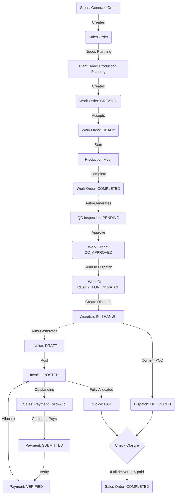

# Comprehensive Operational Workflow: From Lead to Final Settlement

This document maps the complete organizational flow, integrating CRM, Sales, Production Planning, Manufacturing, Quality Control, Dispatch, Payment Follow-up, and Finance.

## 1. CRM & Sales: Capturing the Order
**Goal:** Acquire the lead, negotiate, and finalize the Sales Order.

* **Create Lead:** `/sales/leads/create` ➔ Record prospect details.
* **Leads Dashboard:** `/sales/leads` ➔ Follow up and mark the lead as `WON` (auto-creates a Customer).
* **Create Quotation:** `/sales/quotations/create` ➔ Send pricing to the customer for approval.
* **Convert to Order:** `/sales/orders` ➔ Convert the approved quotation into a final **Sales Order**.

## 2. Plant Head: Planning & Approval
**Goal:** Review incoming orders, allocate resources, and approve them for production.

* **Incoming Orders:** `/plant-head/incoming-orders`
  * Review newly confirmed Sales Orders waiting to be planned.
* **Production Planning:** `/plant-head/planning`
  * Create a production plan for the sales order. This breaks the order down into individual **Work Orders** for the manufacturing floor.
* **Work Order Approval:** `/plant-head/work-orders`
  * The Plant Head reviews newly created work orders and clicks **Accept**. 
  * *Backend Action:* Work Order status changes to `READY` (meaning ready for production).

## 3. Production: Manufacturing
**Goal:** Physically manufacture the goods.

* **Production Floor:** `/production/floor` OR `/production/active`
  * Supervisors see `READY` work orders. 
  * Click **Start** to begin manufacturing (Status: `STARTED`).
  * Once the physical items are manufactured, click **Complete**. 
  * *Backend Action:* Work Order status changes to `COMPLETED`. **Automatically creates a pending QC Inspection.**

## 4. QC: Quality Control
**Goal:** Inspect manufactured goods before they leave the factory.

* **QC Dashboard:** `/qc`
  * QC inspectors see a list of completed work orders awaiting inspection.
* **QC Inspection Page:** `/qc/[id]`
  * The inspector checks the physical items.
  * If everything passes, they approve the inspection.
  * *Backend Action:* Work Order status updates to `QC_APPROVED`.
* **Send to Dispatch:** (Often done from Production or QC dashboard)
  * The approved batch is forwarded to the warehouse.
  * *Backend Action:* Work Order status becomes `READY_FOR_DISPATCH`.

## 5. Dispatch: Fulfillment & Auto-Invoicing
**Goal:** Pack, ship, and generate the bill.

* **Pending Orders:** `/dispatch/orders`
  * Warehouse/Dispatch sees items that are `READY_FOR_DISPATCH`.
* **Create Dispatch:** `/dispatch/create-dispatch`
  * Assign vehicles, drivers, and quantities.
  * *Backend Action:* Sets dispatch to `IN_TRANSIT`. **Automatically generates a Draft Sales Invoice.**
* **Delivery Confirmation:** `/dispatch/delivery`
  * Once the truck reaches the customer, upload the Proof of Delivery (POD).
  * *Backend Action:* Marks dispatch as `DELIVERED`, deducting stock from inventory.

## 6. Sales: Payment Follow-up
**Goal:** Chase the customer to ensure timely payment.

* **Payment Follow-up:** `/sales/payment-followup`
  * Sales executives view a list of open, unpaid invoices for their clients.
  * They call the customer, log notes, and request payment.
* **Record Payment:** `/sales/create-payment`
  * Once the customer pays (e.g., via bank transfer), the sales rep uploads the screenshot/proof of payment.
  * *Backend Action:* Creates a Payment in `SUBMITTED` status for Finance to review.

## 7. Finance: Verification & Settlement
**Goal:** Officially record the revenue and close the ledger.

* **Invoice Posting:** `/finance/invoices` ➔ `/finance/invoices/[id]`
  * Finance reviews the `DRAFT` invoice (auto-generated during dispatch) and clicks **Post Invoice**. This debits the customer's ledger (they owe money).
* **Payment Verification:** `/finance/payment-verification`
  * Finance sees the payment submitted by Sales. They verify it against the bank statement and click **Verify**. This credits the customer's ledger (they paid money).
* **Payment Allocation:** `/finance/payments`
  * Finance maps the verified payment amount to the specific posted invoices (Status becomes `PAID`).
* **Order Closure:** 
  * *Backend Action:* If all items are delivered and all invoices are paid, the original Sales Order automatically updates to `COMPLETED`.
* **Ledger View:** `/finance/ledger`
  * View the complete financial history and zero-balance for the customer.

---

### End-to-End Operational Flowchart

