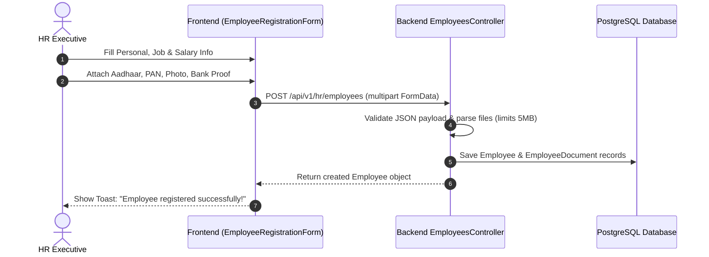
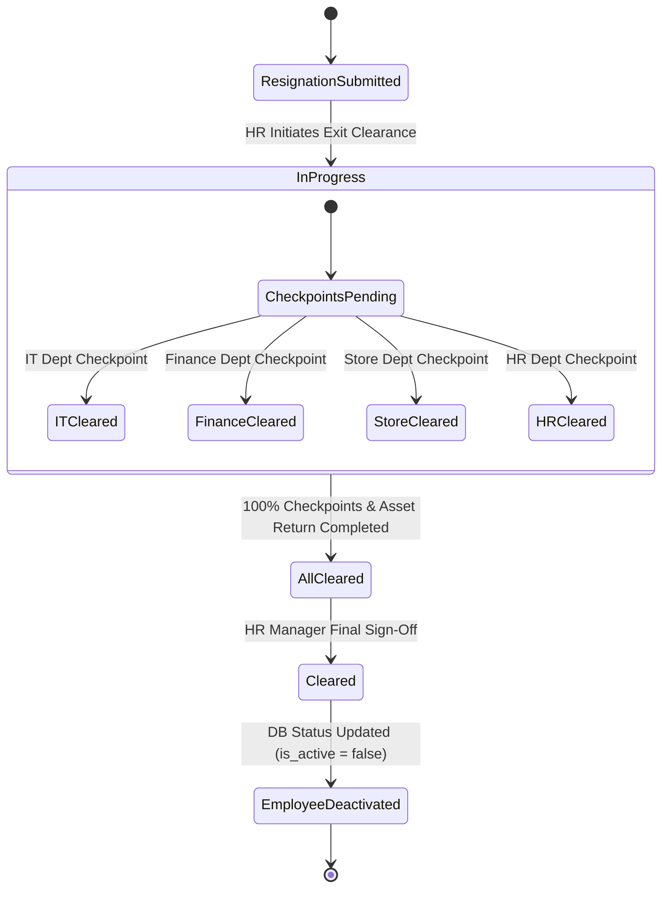

# Himalaya ERP - Complete HR Panel Documentation

> **Module Version**: 2.0  
> **Last Updated**: August 2026  
> **Scope**: Comprehensive Reference for Frontend UI, Backend NestJS Services, Database Schema, Workflows, and API Endpoints for the HR Panel in Himalaya ERP.

---

## 1. Executive Summary & Module Purpose

The **HR (Human Resources) Panel** in Himalaya ERP is an end-to-end enterprise solution for managing the complete employee lifecycle within the organization. It integrates staff registration, attendance tracking, shift scheduling, leave approvals, payroll generation, salary disbursement, notifications, and formal corporate offboarding/exit clearance.

### Core Capabilities
- **Staff Onboarding & Directory**: Multi-step employee registration with identity document attachments, CTC breakdown, and searchable staff directory.
- **Biometric Attendance Simulator & Auditor**: Real-time clock-in/out simulator with grace period auditing (late check-ins, overtime calculations, selfie verification monitor).
- **Shift Scheduling & Management**: Pre-defined corporate shift templates (General, Morning, Night) with quick re-assignment modal for staff members.
- **Leave Workflow Management**: Multi-tier leave applications, manager/plant-head review, HR clearance, and auto-calculation of leave deductions.
- **Payroll Outlay & Salary Management**: Automatic salary structure calculation, unpaid leave deduction, gross/net earnings computation, disbursement, and PDF payslip generation.
- **Corporate Offboarding & Exit Clearance**: 5-step exit clearance modal covering IT, Finance, Store, and HR department checkpoints, physical asset recovery, sign-offs, and CSV/Excel registry exports.
- **HR Notifications & Action Inspector**: Notification panel with instant staff profile inspector for quick administrative actions.
- **User & Access Management**: Mapping system users to employee profiles with RBAC permission enforcement.

---

## 2. System Architecture & Component Mapping

### 2.1 Frontend Architecture (`frontend/modules/hr`)

```
frontend/
├── app/(dashboard)/hr/[[...slug]]/page.tsx   # Catch-all Next.js route for /hr/*
└── modules/hr/
    ├── pages/
    │   └── HRPortal.jsx                      # Main HR portal container & router switch
    ├── components/
    │   ├── ExitClearanceFormModal.jsx        # 5-tab offboarding modal & sign-off form
    │   └── UsersManagementView.jsx           # User credentials & role assignment view
    └── employee/
        ├── components/
        │   ├── EmployeeRegistrationForm.tsx  # Multi-step staff registration form with file uploads
        │   └── EmployeeDetails.tsx           # Individual employee profile details viewer
        ├── employee.db.ts                    # Local fallback database / state mock
        ├── employee.repository.ts            # API repository layer for employee data
        ├── employee.schema.ts                # Zod validation schemas for forms
        ├── employee.selectors.ts             # State selectors for staff entities
        ├── employee.service.ts               # Core employee business logic service
        ├── employee.types.ts                 # TypeScript type definitions
        └── employee.utils.ts                 # Formatting & calculation utilities
```

### 2.2 Shared Frontend Components Integrated into HR
- `LeaveApprovalView.jsx` (`frontend/shared/components/LeaveApprovalView.jsx`) - Specialized leave processing table.
- `HRAttendanceRequestsView.jsx` (`frontend/shared/components/HRAttendanceRequestsView.jsx`) - Attendance correction requests.
- `ExpenseManagementView.jsx` (`frontend/shared/components/ExpenseManagementView.jsx`) - Staff expense reimbursement processing.
- `MyProfileView.jsx` (`frontend/shared/components/MyProfileView.jsx`) - Current user profile inspector.

---

## 3. UI Views & Functional Specifications

### 3.1 HR Dashboard Overview (`/hr/dashboard`)
- **Key Performance Metrics Cards**:
  - **Total Staff Strength**: Total employees and active staff count on the floor.
  - **Daily Attendance**: Calculated attendance percentage (simulated average ~96%).
  - **Leave Requests Awaiting**: Number of pending applications requiring HR action.
  - **Monthly Payroll Outlay**: Total calculated monthly salary budget (displayed in ₹ Lakhs).
- **Employee Department Breakdown**: Real-time list showing employees categorized by Sales, Production, Finance, Operations, etc.
- **HR Action Alerts**: Highlighting pending leave approvals with direct one-click navigation to resolve requests.

### 3.2 Corporate Staff Directory (`/hr/employees` & `/hr/employees/[id]`)
- **Data Table Columns**: Employee Code, Full Name, Department, Designation/Role, Standard Working Days, Paid Days, Unpaid Days, Gross Salary, and Payroll Status (`GENERATED` / `NOT GENERATED`).
- **Global Search**: Filter staff by name or code.
- **Employee Inspector**: Clicking the eye icon opens `EmployeeDetails.tsx` displaying personal details, emergency contact info, salary breakdown, and document attachments.
- **Navigation Action**: Direct link to "Register Staff".

### 3.3 Register Staff / Onboarding (`/hr/register-staff`)
Integrated via `EmployeeRegistrationForm.tsx`.
- **Form Sections**:
  1. **Personal Information**: Full Name, Gender, Date of Birth, Blood Group, Marital Status, Emergency Contact Name & Phone.
  2. **Employment Details**: Employee Code, Department, Work Location, Designation, Employment Type (Full-time, Part-time, Contract), Date of Joining, Reporting Manager.
  3. **Salary & CTC Structure**: Annual CTC, Basic Pay, HRA, Special Allowances, PF/ESI opt-in, Bank Name, Account Number, IFSC Code, PAN.
  4. **Identity & Document Attachments**:
     - Aadhaar Card (PDF/Image)
     - PAN Card (PDF/Image)
     - Bank Passbook / Cancelled Cheque
     - Passport Photograph
     - Digital Signature
     - Additional Supporting Certificates (Up to 20 files, max 5MB per file)
  5. **Shift & System Access**: Initial Shift assignment and auto-linking to system User account.

### 3.4 Biometric Attendance & Clock Auditor (`/hr/attendance`)
- **Grace Period & Clock Simulator**:
  - Controls for adjusting simulation time and date.
  - Quick Presets:
    - `09:05 AM`: Within Grace Window (On Time)
    - `09:25 AM`: Late Check-in (+7 to +25 mins late)
    - `06:15 PM`: Overtime Check-out (+15 mins overtime)
- **Biometric Selfie Monitor**: Visual camera preview simulation displaying staff member photo verification status and assigned shift constraints.
- **Today's Logs Register**: Table recording Biometric Selfie indicator, Employee Code, Staff Name, Log Action (`Check In` / `Check Out`), Punch Time, and Register Status badge.

### 3.5 Shift Schedule Board (`/hr/shifts`)
- **Corporate Shift Templates**:
  - **General Shift**: 09:00 - 18:00 (15 mins grace period)
  - **Morning Shift**: 06:00 - 14:00 (10 mins grace period)
  - **Night Shift**: 22:00 - 06:00 (15 mins grace period)
- **Staff Schedules Table**: Shows assigned shift per employee.
- **Shift Reassignment Popover Modal**: Allows HR admin to select any employee and switch their shift template in real-time.

### 3.6 Leave Workflows (`/hr/leaves`)
- **Workflow Pipeline**: Employee Submission → Manager / Plant Head Recommendation → HR Approval / Rejection.
- **Table View**: Request ID, Employee Name, Start Date, End Date, Duration in Days, Reason, and Status (`PH Pending`, `Pending`, `Approved`, `Rejected`).
- **Action Buttons**: Instant `Approve` and `Reject` buttons with local optimistic UI update and backend database API synchronization.

### 3.7 Corporate Offboarding & Exit Clearance (`/hr/exit-clearance`)
Managed via `ExitClearanceFormModal.jsx` and interactive clearance registry.
- **Registry Table**:
  - Employee Code, Resigning Staff, Department, Effective Resignation Date.
  - Interactive Checkpoints Matrix: IT, Finance, Store, HR. Checkboxes allow immediate status toggling.
  - Progress bar (0% - 100%) and Overall Status (`In Progress` / `Cleared`).
  - Form Viewer: Opens `ExitClearanceFormModal`.
  - Export Options: Instant export to CSV (`exportToCSV`) and Excel (`exportToExcel`).
- **5-Tab Exit Clearance Modal (`ExitClearanceFormModal.jsx`)**:
  1. **Tab 1 - Employee Details**: Resignation Date, Last Working Day, Notice Period (days), Notice Served, Reporting Manager.
  2. **Tab 2 - Clearance Checklist**: Status selections for Work Handover, Assets Return, Finance Dues, Admin Clearance, Manager Clearance, Exit Interview, Leave Balance, Full & Final (F&F) Settlement.
  3. **Tab 3 - Asset Return Matrix**: Checkboxes for Laptop/PC, External Monitor, Keyboard & Mouse, Mobile Charger, Company ID Card, Office Keys, Headset/Disks, Physical Documents/Files, and Other Custom Assets.
  4. **Tab 4 - Approvals & Signatures**: Sign-off fields for Employee Signature, Manager Signature, HR Officer Sign-off, Approval Remarks, and Company Seal Stamp selector (`Himalaya Enterprises - HR Seal`).
  5. **Tab 5 - Form Summary**: Detailed printable/viewable sign-off document summarizing clearance status.

### 3.8 Payroll & Salary Management (`/hr/salary/prepare`, `/hr/salary-structure`, `/hr/salary/history`)
- **Salary Computation Logic**:
  $$\text{Net Payable} = \text{Base Salary} - (\text{Unpaid Leave Days} \times \text{Daily Rate Deduction})$$
- **Payroll Table**: Employee Code, Name, Department, Designation, Base Salary, Leave Deductions, and Net Payable amount.
- **Disbursement Action**: One-click batch salary disbursement triggering notification toast and financial ledger logging.
- **PDF Payslip Generation**: Backend NestJS payroll service generates official downloadable PDF payslips (`salary-slip.pdf.ts`).

### 3.9 HR Notifications & Staff Inspector (`/hr/notifications`)
- **Alert Feed**: System alerts for pending leave applications, ongoing exit clearance progress, and upcoming anniversaries/probation reviews.
- **Detailed Staff Profile Inspector**: Clicking any alert opens a right-hand sidebar panel displaying staff role, department, base salary, attendance rate %, and direct CTA to resolve the alert.

---

## 4. Backend NestJS API Inventory

All HR endpoints are guarded with `JwtAuthGuard` and `PermissionsGuard`. Base URL prefix: `/api/v1/hr` (or `/hr`).

### 4.1 Employee Management Endpoints (`/hr/employees`)

| Method | Endpoint | Description | Required Permission |
| :--- | :--- | :--- | :--- |
| `GET` | `/hr/employees` | List all employees with pagination & search | `hr.employees.read` |
| `POST` | `/hr/employees` | Create employee with multi-file uploads | `hr.employees.create` |
| `GET` | `/hr/employees/:id` | Get single employee details | `hr.employees.read` |
| `PATCH` | `/hr/employees/:id` | Update employee information | `hr.employees.update` |
| `DELETE` | `/hr/employees/:id` | Soft-delete / deactivate employee | `hr.employees.delete` |
| `PATCH` | `/hr/employees/:id/status` | Update employee active status / exit status | `hr.employees.status.update` |
| `GET` | `/hr/employees/payroll-overview` | Get payroll overview & day counts for all staff | `hr.payroll.read` |
| `GET` | `/hr/employees/:id/attendance-summary` | Fetch attendance summary for employee | `hr.payroll.read` |
| `GET` | `/hr/employees/:id/salary-history` | Fetch salary history records for employee | `hr.payroll.read` |
| `GET` | `/hr/employees/drafts` | List saved onboarding drafts | `hr.employees.create` |
| `POST` | `/hr/employees/drafts` | Save draft onboarding form | `hr.employees.create` |
| `GET` | `/hr/employees/managers` | List eligible reporting managers | `hr.employees.read` |
| `GET` | `/hr/departments` | List company departments | `hr.departments.read` |
| `GET` | `/hr/work-locations` | List company work locations | `hr.locations.read` |
| `POST` | `/hr/employees/:id/documents` | Upload individual document file | `hr.employees.documents.upload` |
| `DELETE` | `/hr/employees/:empId/documents/:docId` | Delete specific document attachment | `hr.employees.documents.delete` |

### 4.2 Leave Management Endpoints (`/hr/leaves` or `/leave`)

| Method | Endpoint | Description | Required Permission |
| :--- | :--- | :--- | :--- |
| `GET` | `/leave` | List leave requests | `hr.leaves.read` |
| `POST` | `/leave` | Submit leave request | `hr.leaves.create` |
| `PATCH` | `/admin/employees/leaves/:id` | Approve or Reject leave request | `hr.leaves.approve` |

### 4.3 Payroll Endpoints (`/hr/payroll` or `/payroll`)

| Method | Endpoint | Description | Required Permission |
| :--- | :--- | :--- | :--- |
| `GET` | `/payroll/overview` | Payroll summary overview | `hr.payroll.read` |
| `POST` | `/payroll/generate` | Generate monthly payroll records | `hr.payroll.create` |
| `POST` | `/payroll/disburse` | Process batch salary disbursement | `hr.payroll.disburse` |
| `GET` | `/payroll/payslip/:id/pdf` | Download generated PDF payslip | `hr.payroll.read` |

---

## 5. Database Schema & Data Models

The HR module interacts primarily with the following Prisma models in `backend/prisma/schema.prisma`:

### 5.1 `Employee` Model
- `id` (UUID, PK)
- `companyId` (FK to `Company`)
- `employeeCode` (Unique String, e.g., `EMP-001`)
- `firstName`, `lastName`, `fullName`
- `email`, `phone`, `dateOfBirth`, `gender`
- `departmentId` (FK to `Department`)
- `workLocationId` (FK to `WorkLocation`)
- `jobTitle` / `designation`
- `dateOfJoining`, `exitDate`, `exitStatus`
- `isActive` (Boolean)
- `ctc`, `basicSalary`, `hra`, `specialAllowance`
- `panNumber`, `aadhaarNumber`, `pfNumber`, `esiNumber`
- `bankName`, `bankAccountNumber`, `bankIfsc`
- `userId` (Optional FK to `User` for login access)

### 5.2 Supporting HR Models
- `Department`: `id`, `name`, `code`, `companyId`
- `WorkLocation`: `id`, `name`, `address`, `companyId`
- `LeaveRequest`: `id`, `employeeId`, `startDate`, `endDate`, `leaveType`, `reason`, `status`, `approvedById`
- `PayrollRecord`: `id`, `employeeId`, `month`, `year`, `workingDays`, `paidDays`, `unpaidDays`, `grossSalary`, `deductions`, `netSalary`, `status`
- `EmployeeDocument`: `id`, `employeeId`, `documentType`, `fileUrl`, `fileName`

---

## 6. End-to-End Workflows

### 6.1 Employee Onboarding Workflow


### 6.2 Offboarding & Exit Clearance Workflow


---

## 7. RBAC & Security Permissions

| Role | Employee Read | Employee Create/Edit | Leave Approve | Payroll Disburse | Exit Clearance Sign-off |
| :--- | :---: | :---: | :---: | :---: | :---: |
| **Super Admin** | ✅ | ✅ | ✅ | ✅ | ✅ (Read-Only monitor) |
| **HR Manager** | ✅ | ✅ | ✅ | ✅ | ✅ |
| **HR Executive** | ✅ | ✅ | ✅ | ❌ | ⏳ Checkpoint only |
| **Department Manager** | 👁️ Team only | ❌ | ✅ Team only | ❌ | ⏳ Dept Checkpoint |
| **Standard Employee** | 👁️ Self profile | ❌ | 📝 Self apply | ❌ | ❌ |

---

## 8. Summary of UI File Locations

- **Catch-all Route**: [page.tsx](file:///d:/prototype-next-main/frontend/app/%28dashboard%29/hr/%5B%5B...slug%5D%5D/page.tsx)
- **Main HR Portal Container**: [HRPortal.jsx](file:///d:/prototype-next-main/frontend/modules/hr/pages/HRPortal.jsx)
- **Exit Clearance Form Modal**: [ExitClearanceFormModal.jsx](file:///d:/prototype-next-main/frontend/modules/hr/components/ExitClearanceFormModal.jsx)
- **Users Management View**: [UsersManagementView.jsx](file:///d:/prototype-next-main/frontend/modules/hr/components/UsersManagementView.jsx)
- **Employee Registration Form**: [EmployeeRegistrationForm.tsx](file:///d:/prototype-next-main/frontend/modules/hr/employee/components/EmployeeRegistrationForm.tsx)
- **Employee Profile Details**: [EmployeeDetails.tsx](file:///d:/prototype-next-main/frontend/modules/hr/employee/components/EmployeeDetails.tsx)
- **Navigation Configuration**: [navigationConfig.js](file:///d:/prototype-next-main/frontend/lib/navigationConfig.js#L186-L199)
- **Backend Controller**: [employees.controller.ts](file:///d:/prototype-next-main/backend/src/modules/employees/employees.controller.ts)
- **Backend Service**: [employees.service.ts](file:///d:/prototype-next-main/backend/src/modules/employees/employees.service.ts)
