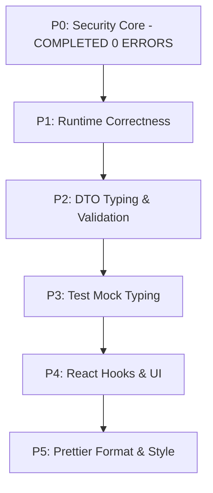

# 03 — Repository Code Quality & Lint Roadmap

## 1. Overview & Categorization Status

- **Status**: **VERIFIED**
- **Strategy**: Targeted strict zero-warning enforcement on Security Core, combined with categorized roadmap for remaining repository files.
- **Rule Suppression Policy**: No global rule disablements (`"eslint-disable"` in config or `.eslintrc`). Line-level disables permitted only with documented justification.

---

## 2. Repository Error & Warning Categorization

Remaining repository lint issues across `backend/` and `src/` are categorized into 6 distinct technical buckets:

| Category | Priority | Impact Area | Primary Causes | Remediation Strategy |
| :--- | :---: | :--- | :--- | :--- |
| **1. Security Critical** | **P0** | Auth Guards, RBAC, Encryption, Password, Throttler | Implicit `any` in request headers, un-typed JWT payloads | **VERIFIED (0 errors, 0 warnings achieved in Phase E)** |
| **2. Runtime Correctness** | **P1** | Business Controllers & Services | Unhandled promise rejections, unsafe type casting (`as any`) | Replace with explicit DTOs & async/await error handlers |
| **3. DTO Typing** | **P2** | NestJS Request DTOs | Missing `class-validator` / `class-transformer` decorators | Add `@IsString()`, `@IsOptional()`, `@IsNumber()` decorators |
| **4. Test Architecture** | **P3** | Unit Specs & E2E Spec Files | `@typescript-eslint/no-explicit-any` in mock objects | Use shared mock factories in `test/mocks/` |
| **5. React Frontend** | **P4** | Next.js Frontend Pages (`src/pages`) | Unused React variables, missing hook dependency arrays | Run `eslint --fix` on frontend components |
| **6. Cosmetic & Style** | **P5** | Workspace Utilities & Configs | Unused imports, trailing spaces, quote consistency | Format via Prettier / ESLint autofix |

---

## 3. Remediation Roadmap



### Phase E Verification Proof

```bash
npx eslint src/common/guards/ src/common/types/security.types.ts
# Result: 0 errors, 0 warnings
```
