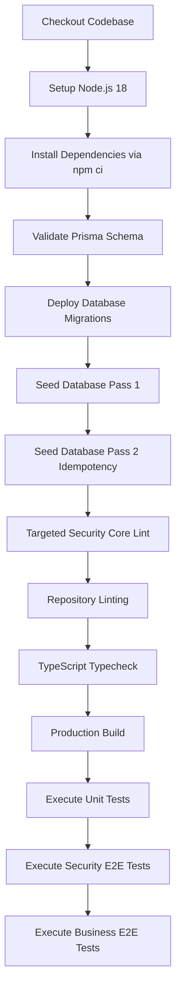

# Phase E — CI Quality Gate Specification

## 1. Overview

The continuous integration pipeline is defined in `.github/workflows/ci.yml`. It enforces a non-bypassable quality gate executing 14 ordered verification steps against a dedicated PostgreSQL service container.

---

## 2. Pipeline Execution Sequence



---

## 3. Workflow Configuration

```yaml
name: Backend Quality Gate Pipeline

on:
  push:
    branches: [ main, master, develop ]
  pull_request:
    branches: [ main, master, develop ]

jobs:
  backend-quality-gate:
    name: Backend Production Quality Gate
    runs-on: ubuntu-latest

    services:
      postgres:
        image: postgres:15-alpine
        env:
          POSTGRES_USER: postgres
          POSTGRES_PASSWORD: postgrespassword
          POSTGRES_DB: himalaya_erp_test
        ports:
          - 5432:5432

    steps:
      - uses: actions/checkout@v4
      - uses: actions/setup-node@v4
        with:
          node-version: 18
          cache: 'npm'
      - run: npm ci --workspace=backend
      - run: npx prisma validate --schema=backend/prisma/schema.prisma
      - run: npx prisma migrate deploy --schema=backend/prisma/schema.prisma
      - run: cd backend && npx prisma db seed
      - run: cd backend && npx prisma db seed
      - run: cd backend && npx eslint src/common/guards/ src/common/types/security.types.ts
      - run: cd backend && npm run lint
      - run: cd backend && npx tsc --noEmit
      - run: cd backend && npm run build
      - run: cd backend && npm test
      - run: cd backend && npm run test:e2e:security
      - run: cd backend && npm run test:e2e:procurement
```
