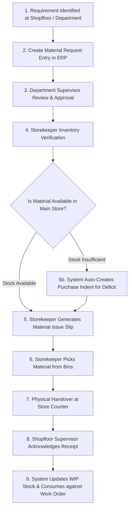

# Functional Process & User Journey Documentation: Material Request Flow

This document details the step-by-step business process, operational user journey, store management procedures, and material transfer workflows for internal store requisitions and production shopfloor requests.

---

## 1. Flow Overview & Visual Workflow

---

## 2. Step-by-Step Functional Journey

### Stage 1: Requirement Identification & Requisition Entry
* **Actor**: Shopfloor Operator, Maintenance Technician, Department Supervisor
* **Action**:
  1. Operator notices raw material / spare component requirement on the production line or for maintenance work.
  2. Operator opens the ERP **Material Request Module** and fills in:
     - **Request Type**: `Production Work Order`, `Store Transfer`, or `Departmental Consumption`.
     - **Target Work Order**: Work Order Number (e.g. `WO-2026-088`).
     - **Item Details**: Part numbers, descriptions, required quantities, and required delivery date/time.
     - **Destination Store**: Shopfloor Store / WIP Area.

---

### Stage 2: Departmental Approval
* **Actor**: Production Manager / Department Head (HOD)
* **Action**:
  1. HOD receives a notification for pending Material Requisition.
  2. HOD checks if the requested quantity matches the Bill of Materials (BOM) for the target Work Order.
  3. If valid, HOD approves the requisition. Status updates to `APPROVED_BY_HOD`.

---

### Stage 3: Store Verification & Reservation
* **Actor**: Main Warehouse Storekeeper
* **Action**:
  1. Storekeeper views approved Material Requests on the Store Dashboard.
  2. ERP automatically performs an inventory check in the Main Warehouse:
     - **Scenario A (Sufficient Stock)**: ERP reserves the required stock items in the Main Warehouse so they cannot be allocated elsewhere.
     - **Scenario B (Partial / Out of Stock)**: Storekeeper issues available stock, and the ERP automatically generates a **Purchase Indent** to procure the remaining shortfall.

---

### Stage 4: Picking & Material Issue Slip Generation
* **Actor**: Storekeeper
* **Action**:
  1. Storekeeper prints a **Material Issue Slip (MIS) / Picking List** detailing:
     - Item location (Aisle, Rack, Bin number).
     - Lot / Batch number to pick (following **FIFO - First In First Out** or **FEFO - First Expiry First Out** principles).
  2. Storekeeper picks physical items from warehouse bins and packs them for transport to the shopfloor.

---

### Stage 5: Physical Handover & Receipt Acknowledgment
* **Actor**: Storekeeper, Shopfloor Material Handler
* **Action**:
  1. Material handler receives physical items at store issuance counter.
  2. Handler verifies item description, quantity, and batch numbers against the physical Material Issue Slip.
  3. Handler scans QR code or digitally signs the ERP Material Issue document.
  4. System updates inventory balances:
     - Main Warehouse Stock decreases.
     - Work-In-Progress (WIP) / Shopfloor Store Stock increases.
     - Material cost is assigned to the active Production Work Order.
