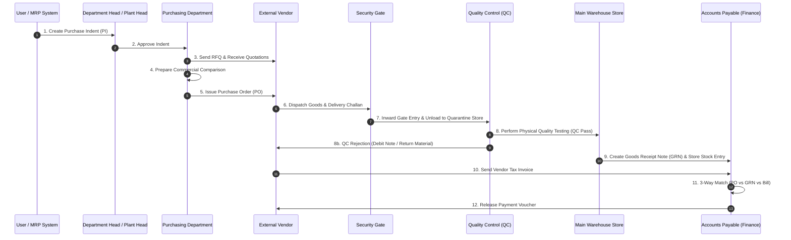

# Functional Process & User Journey Documentation: Purchase Indent & Material Flow (P2P)

This document details the step-by-step business process, operational user journey, procurement approvals, vendor interaction, and quality inspection workflow for the **Procure-to-Pay (P2P)** material lifecycle.

---

## 1. Flow Overview & Visual Workflow

---

## 2. Step-by-Step Functional Journey

### Stage 1: Purchase Indent (PI) Requisition
* **Actor**: Department User, Maintenance Manager, or Automated MRP System
* **Action**:
  1. Material requirement is triggered manually (by department) or automatically (when stock drops below Min-Max Reorder level or during Material Requirements Planning run).
  2. User submits a **Purchase Indent (PI)** in ERP specifying:
     - Item specifications and drawing numbers.
     - Required quantity and unit of measure.
     - Target delivery date and target cost estimation.
     - Purpose / Cost Center allocation.

---

### Stage 2: Multi-Tier Indent Approval
* **Actor**: Department Head, Plant Head, Finance Director
* **Action**:
  1. Indent routes through approval matrix based on total estimated budget:
     - *Under $1,000*: Department Head approval.
     - *$1,000 - $10,000*: Plant Head approval.
     - *Above $10,000*: Managing Director / Finance VP approval.
  2. Once approved, status changes to `INDENT_APPROVED` and is passed to the Procurement team.

---

### Stage 3: Request for Quotation (RFQ) & Vendor Selection
* **Actor**: Purchase Executive
* **Action**:
  1. Purchase executive generates a **Request for Quotation (RFQ)** for approved indent items.
  2. RFQ is sent to registered vendors via ERP portal or email.
  3. Vendors submit quotes containing price per unit, delivery lead time, payment terms, and warranty terms.
  4. Purchase executive compiles a **Commercial Comparison Matrix (CS Statement)** comparing 3+ vendor quotes.
  5. Procurement Head approves winning vendor quote.

---

### Stage 4: Purchase Order (PO) Issuance
* **Actor**: Procurement Manager
* **Action**:
  1. System generates a formal **Purchase Order (PO)** with terms:
     - Agreed pricing, taxes (GST/VAT), packaging and freight terms.
     - Delivery schedule and penalties for delay (Liquidated Damages clause).
  2. PO is digitally signed and dispatched to the vendor.
  3. Vendor confirms receipt and provides a **PO Acknowledgment**.

---

### Stage 5: Security Gate Entry & Inward Receipt
* **Actor**: External Vendor Transporter, Factory Gate Security Guard
* **Action**:
  1. Vendor delivers physical shipment to factory gate.
  2. Security guard inspects physical package condition and vendor Delivery Challan / Lorry Receipt (LR).
  3. Security registers a **Gate Entry Slip** in ERP, capturing vehicle number, driver details, gross weight, and challan date.
  4. Goods are unloaded into the **Quarantine / Uninspected Goods Holding Store**.

---

### Stage 6: Quality Control (QC) Inspection
* **Actor**: QC Inspector / Lab Technician
* **Action**:
  1. QC inspector samples items from the quarantine store.
  2. Performs laboratory, chemical, or dimensional testing against PO technical parameters.
  3. Inspector inputs test results into the **QC Inspection Entry**:
     - **Accepted Quantity**: Moved to Main Warehouse Store.
     - **Rejected Quantity**: Marked for return. Vendor is notified to pick up rejected material. System auto-generates a **Vendor Return / Debit Note**.

---

### Stage 7: Goods Receipt Note (GRN) & Stock Post
* **Actor**: Warehouse Storekeeper
* **Action**:
  1. Storekeeper generates a **Goods Receipt Note (GRN)** for the QC-passed quantity.
  2. Items are assigned physical bin locations in the Main Warehouse.
  3. System automatically increases available raw material stock.

---

### Stage 8: Invoice Matching & Payment Release
* **Actor**: Accounts Payable (AP) Accountant
* **Action**:
  1. Vendor sends final Tax Invoice.
  2. Accountant performs **3-Way Matching**:
     - PO Unit Price vs Invoice Unit Price.
     - GRN Accepted Quantity vs Invoice Billed Quantity.
  3. If matched cleanly, Accountant approves Vendor Invoice and schedules payment as per agreed payment terms (e.g. *NET 45 Days*).
  4. Finance releases bank payment voucher upon due date.
