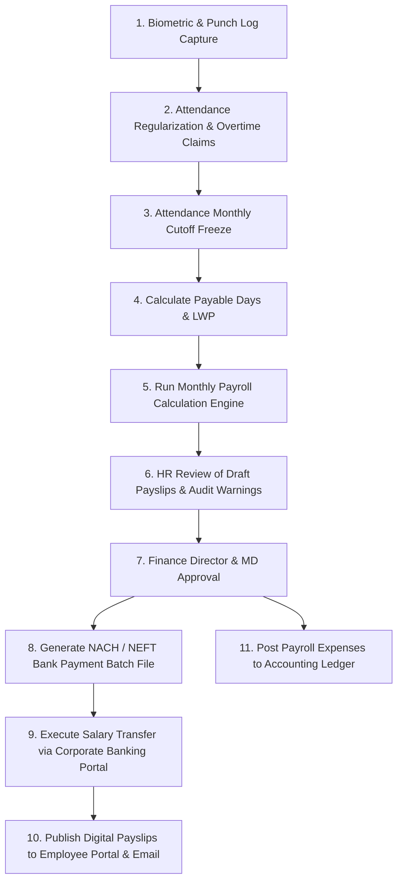

# Functional Process & User Journey Documentation: HR Salary Preparation Flow

This document details the step-by-step business process, operational user journey, attendance cutoff procedures, statutory compliance, and disbursement workflow for monthly HR payroll execution.

---

## 1. Flow Overview & Visual Workflow

---

## 2. Step-by-Step Functional Journey

### Stage 1: Attendance & Punch Log Synchronization
* **Actor**: HR Executive, Biometric System Integration
* **Action**:
  1. Biometric attendance devices (fingerprint / facial recognition) at all factory gates sync daily punch logs into ERP.
  2. HR tracks daily attendance logs, missing punches, late arrivals, and early exits.

---

### Stage 2: Leave & Overtime (OT) Regularization
* **Actor**: Employees, Department Managers, HR Executive
* **Action**:
  1. Employees submit pending leave applications (Casual Leave, Sick Leave, Earned Leave) for any absences.
  2. Managers approve or reject leave applications.
  3. Overtime (OT) hours logged by shopfloor supervisors are verified against production logs and approved by HODs.
  4. On the 25th of every month (or payroll cutoff date), HR clicks **Attendance Cutoff Freeze**. No further leave modifications are allowed for the current billing cycle.

---

### Stage 3: Payable Days & Loss of Pay (LWP) Audit
* **Actor**: HR Payroll Specialist
* **Action**:
  1. System calculates **Payable Days** for every employee:
     $$\text{Payable Days} = \text{Total Calendar Days} - \text{Unapproved Absences (LWP)}$$
  2. HR runs an **Attendance Variance Exception Report** to review employees with incomplete punches or zero payable days.

---

### Stage 4: Salary Calculation Run
* **Actor**: HR Payroll Specialist, ERP Payroll Calculator
* **Action**:
  1. HR triggers **Run Monthly Payroll** for the target month (e.g. *July 2026*).
  2. **Automated Calculations**:
     - *Pro-rated Gross Salary*: Basic, HRA, and Special Allowances adjusted according to Payable Days.
     - *Overtime Payment*: OT hours $\times$ OT hourly rate (e.g. *1.5x / 2.0x base rate*).
     - *Statutory Deductions*:
       - **PF (Provident Fund)**: 12% deduction on basic salary up to statutory ceiling.
       - **ESI (Employee State Insurance)**: 0.75% deduction for gross wages $\le \$21,000$.
       - **PT (Professional Tax)**: Slab-based state tax.
       - **TDS (Income Tax)**: Projected monthly income tax deduction based on employee investment declarations.
     - *Loan & Salary Advance Recovery*: Auto-deduct monthly installment for active salary loans.
  3. System generates draft payslips and a master **Payroll Summary Sheet**.

---

### Stage 5: Verification & Management Approvals
* **Actor**: HR Manager, Finance Controller, Managing Director
* **Action**:
  1. HR Manager audits variance compared to previous month's total payout (flagging new joiners, exits, high OT payouts).
  2. HR Manager approves and submits payroll batch to Finance.
  3. Finance Controller and Managing Director review total financial commitment and give **Final Payroll Approval**.
  4. Status changes to `PAYROLL_LOCKED`.

---

### Stage 6: Bank Disbursement & Accounting Ledger Posting
* **Actor**: Finance Treasury / Accounts Team
* **Action**:
  1. Finance team exports a **Bank Payment Batch File (NACH / NEFT format)** from ERP containing employee bank account numbers, IFSC codes, and net salary amounts.
  2. Finance uploads file to the Corporate Net Banking portal and executes salary transfers.
  3. ERP automatically posts general ledger accounting vouchers (Salary Expense Account debited, Bank Account credited).

---

### Stage 7: Payslip Publishing
* **Actor**: HR System
* **Action**:
  1. System publishes encrypted PDF payslips to the **Employee Self-Service (ESS) Portal & Mobile App**.
  2. Automated emails containing payslips are sent to all employees.
