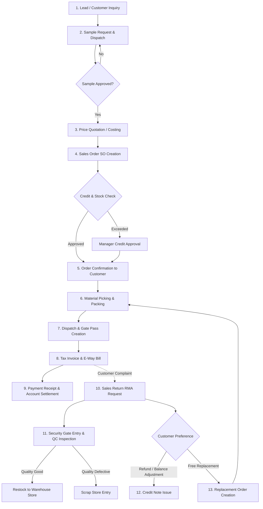

# Functional Process & User Journey Documentation: Sales Order, Replacement & Return Flow

> **Supporting document:** The canonical source of truth is
> [Complete Sales Order Lifecycle ERP Workflow](../../../docs/complete-sales-order-lifecycle.md).
> If this supporting journey conflicts with the canonical states, gates, or
> acceptance rules, the canonical specification takes precedence.

This document details the step-by-step business process, operational user journey, decision checkpoints, and documentation lifecycle for the complete **Sales & Customer Order Management** lifecycle.

---

## 1. Flow Overview & Visual Workflow

---

## 2. Step-by-Step Functional Journey

### Stage 1: Lead Generation & Customer Inquiry
* **Actor**: Sales Executive / Business Development Team
* **Action**:
  1. A new prospective customer or existing client sends an inquiry (via email, phone, web form, or trade fair).
  2. Sales executive creates a **Lead Entry** in the ERP CRM module with contact details, product interest, and required quantities.
  3. Lead status set to `QUALIFIED` after verifying business legitimacy and feasibility.

---

### Stage 2: Sample Request & Evaluation
* **Actor**: Sales Executive, QA Team, Dispatch Storekeeper
* **Action**:
  1. Customer requests a trial sample before placing a bulk order.
  2. Sales executive submits a **Sample Request Form** specifying product specs and target testing date.
  3. Storekeeper picks sample stock (or Production creates a prototype sample).
  4. Sample is dispatched with a **Sample Delivery Slip** (marked *Not for Commercial Sale*).
  5. **Outcome**: Customer tests sample and provides formal approval (Certificate of Analysis / Approval email).

---

### Stage 3: Commercial Quotation & Proforma Invoice
* **Actor**: Sales Manager, Commercial Team
* **Action**:
  1. Sales team prepares a **Sales Quotation** containing:
     - Item descriptions and technical specifications.
     - Unit pricing, volume discounts, and applicable taxes (GST/VAT).
     - Freight terms (FOB, CIF, EX-Works) and delivery timeline.
     - Validity period (e.g., *Valid for 15 days*).
  2. Quotation is sent to the customer.
  3. Upon customer negotiation and agreement, a **Proforma Invoice (PI)** is issued for advance payment (if required).

---

### Stage 4: Sales Order (SO) Creation & Approvals
* **Actor**: Sales Operations Manager, Credit Control Officer
* **Action**:
  1. Customer sends an official **Purchase Order (PO)**.
  2. Sales team enters a **Sales Order (SO)** in the ERP, attaching the customer's PO.
  3. **Automated ERP System Checks**:
     - *Stock Check*: Verifies if finished goods are available or if a Production Work Order is required.
     - *Credit Limit Check*: Verifies customer's outstanding dues against their approved credit limit and credit days (e.g. *30 Days*).
  4. If credit limit is exceeded, system puts order on `CREDIT_HOLD`. Sales Manager / Finance Head must review and approve.
  5. Upon approval, SO moves to `CONFIRMED`. System reserves finished goods stock.

---

### Stage 5: Picking, Packing & Dispatch
* **Actor**: Warehouse Storekeeper, Logistics Supervisor, Gate Security
* **Action**:
  1. ERP generates a **Picking List** for the storekeeper.
  2. Storekeeper picks items, verifies batch numbers and manufacturing dates, and packs the goods.
  3. Storekeeper creates a **Delivery Note / Packing Slip**.
  4. Logistics team assigns a transporter, vehicle number, and driver details.
  5. Security guard at factory gate inspects vehicle, weighs truck (tare/gross weight), and generates a **Gate Pass**.

---

### Stage 6: Invoicing & Payment Settlement
* **Actor**: Accounts / Billing Department
* **Action**:
  1. Billing team converts Delivery Note into a formal **Tax Invoice**.
  2. E-Way Bill and E-Invoice (QR Code) are generated via statutory tax portals.
  3. Invoice copy is sent to customer along with shipment.
  4. Finance team tracks payment terms and sends payment reminders.
  5. Upon receiving payment, Finance records a **Payment Receipt Voucher** against customer account.

---

## 3. Customer Return Order Flow (RMA)

### Operational Sequence:
1. **Return Complaint**: Customer files a complaint regarding damaged, defective, or incorrect items received.
2. **RMA Authorization**: Sales / Support Manager reviews complaint, photos, and invoice reference, then approves a **Return Merchandise Authorization (RMA)** ticket.
3. **Gate Arrival & Inward Entry**: Transporter delivers returned goods back to factory gate. Security logs inward entry.
4. **Quality Control (QC) Audit**:
   - QC inspector tests returned items.
   - **Pass (Good Condition)**: Items placed back into Main Warehouse finished goods inventory.
   - **Fail (Defective/Damaged)**: Items sent to Scrap Warehouse for disposal/recycling.
5. **Credit Note Issuance**: Finance team generates a **Credit Note** against original invoice, reducing customer's outstanding balance or initiating a bank refund.

---

## 4. Replacement Order Flow

### Operational Sequence:
1. **Replacement Request**: Customer requests a free replacement item instead of a financial refund.
2. **Replacement SO Generation**:
   - System creates a **Replacement Sales Order** linked directly to the approved RMA ticket.
   - Price is set to `$0.00` (Free of Charge fulfillment).
3. **Dispatch & Customer Sign-off**:
   - Warehouse picks new items from stock.
   - Goods dispatched with a **Replacement Delivery Slip**.
   - Customer signs Proof of Delivery (POD) upon receiving replacement goods, closing the RMA ticket.
