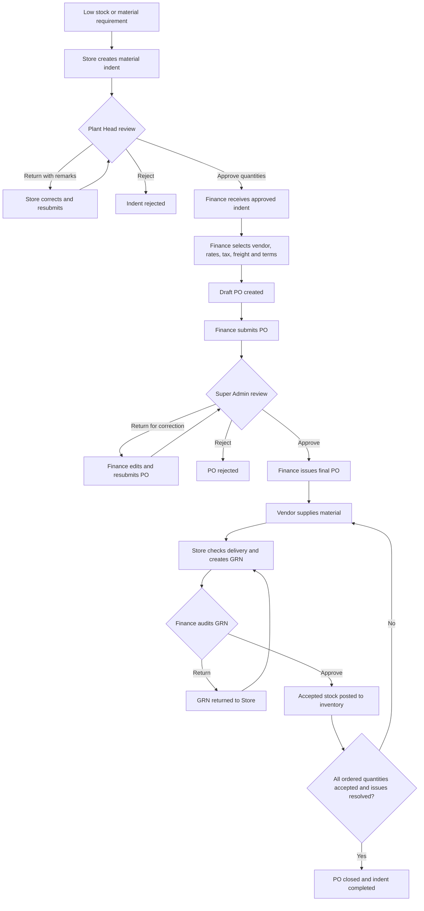

# Purchase Indent: Complete Application Flow

## 1. Purpose

This document describes the purchase-indent flow currently implemented in the ERP prototype. It follows a material requirement from the Store team through approval, purchase-order creation, delivery, GRN and finance audit, until the procurement request is completed.

> Scope: material purchase indents. Recruitment indents and customer sales orders are outside this flow.

## 2. End-to-End Flow



## 3. Actors and Responsibilities

| Actor | Main responsibility |
|---|---|
| Store Executive / Store Admin | Identify shortage, create the indent, track it, receive material and prepare the GRN |
| Plant Head | Review need and requested quantity; approve, reject, or return the indent |
| Finance | Create and submit the PO, issue the approved PO, audit the GRN, and handle invoice/payment activities |
| Super Admin | Approve, reject, or return the PO for correction |
| Vendor | Accept the issued PO and supply the ordered material |
| System | Generates IDs, calculates PO totals, prevents invalid transitions, records history, posts approved stock, and closes eligible records |

## 4. Detailed User Journey

### Step 1 — Identify a material requirement

The usual trigger is a material at or below its minimum stock level. The Store user can start the process from the low-stock area or the procurement request screen.

The Store user reviews:

- material name and code;
- current and minimum stock;
- required quantity and unit;
- target/required date;
- priority;
- remarks or business reason.

### Step 2 — Create and submit the material indent

**Actor:** Store

The Store user enters one or more material lines and submits the request. The system:

- creates an indent such as `#INDENT1`;
- creates a line ID for each item;
- records requested quantities;
- sets the requesting department to Store;
- adds creation details to the history;
- prevents an immediate duplicate caused by a double-click;
- sends the indent to the Plant Head queue.

**New status:** `PENDING_PLANT_HEAD_APPROVAL`

The Store user can monitor all requests from **Indent History**.

### Step 3 — Plant Head reviews the indent

**Actor:** Plant Head

The Plant Head opens **Material Indent Approvals**, selects a pending indent, reviews its dates, priority, remarks, stock context and line items, and may adjust the approved quantity on each line.

The available decisions are:

1. **Approve** — saves the approved quantities and forwards the request to Finance.
2. **Return for correction** — sends it back to Store; remarks are mandatory.
3. **Reject** — closes the approval path as rejected; remarks should explain the decision.

| Decision | Resulting status | Next owner |
|---|---|---|
| Approve | `PLANT_HEAD_APPROVED` | Finance |
| Return | `PLANT_HEAD_CORRECTION_REQUIRED` | Store |
| Reject | `PLANT_HEAD_REJECTED` | End/Store history |

When an indent is returned, Store corrects it and resubmits it. It returns to `PENDING_PLANT_HEAD_APPROVAL`.

### Step 4 — Finance creates a draft purchase order

**Actor:** Finance

Only a `PLANT_HEAD_APPROVED` indent without an existing active PO can be converted. Finance opens the approved-indent queue and selects **Create PO**.

Finance enters or confirms:

- vendor;
- item quantities and unit rates;
- GST percentage;
- freight;
- expected delivery date;
- payment terms.

The system calculates:

```text
Line subtotal = ordered quantity × unit rate
Subtotal      = sum of line subtotals
GST amount    = subtotal × GST percentage
Grand total   = subtotal + GST amount + freight
```

It then creates a PO such as `#PO1`.

| Record | Resulting status |
|---|---|
| PO | `DRAFT` |
| Indent | `DRAFT_PO_CREATED` |

The system prevents more than one active PO from being created for the same indent.

### Step 5 — Finance submits the PO for approval

**Actor:** Finance

Finance can edit a PO while it is `DRAFT` or `CORRECTION_REQUIRED`. After verifying commercial details, Finance submits it to Super Admin.

**New PO status:** `PENDING_SUPER_ADMIN_APPROVAL`

### Step 6 — Super Admin reviews the PO

**Actor:** Super Admin

The Super Admin reviews the vendor, item quantities, rates, GST, freight, total, delivery date and payment terms.

| Decision | Resulting status | Next action |
|---|---|---|
| Approve | `SUPER_ADMIN_APPROVED` | Finance issues the PO |
| Return for correction | `CORRECTION_REQUIRED` | Finance edits and resubmits |
| Reject | `SUPER_ADMIN_REJECTED` | PO process stops |

Remarks are mandatory when returning or rejecting a PO.

### Step 7 — Finance issues the approved PO

**Actor:** Finance

Only a `SUPER_ADMIN_APPROVED` PO can be issued. Finance assigns or generates the final PO number and issues it to the vendor.

**New PO status:** `PO_ISSUED`

**Delivery status:** `AWAITING_DELIVERY`

The issue date, issuer and final PO number are added to the PO history.

The prototype also supports recording vendor acceptance and an expected delivery date as `VENDOR_ACCEPTED`. See the implementation note in section 10.

### Step 8 — Store receives and inspects the delivery

**Actor:** Store

When the material arrives, Store opens the PO in the delivery/receiving area and records:

- delivery challan or invoice reference;
- received date;
- received quantity per item;
- accepted quantity;
- rejected quantity;
- inspection remarks;
- supporting delivery information, where available.

The system validates that:

- the PO is eligible for receipt;
- received quantities are positive;
- cumulative receipts do not exceed the ordered quantity;
- accepted plus rejected quantity agrees with the received quantity.

Partial deliveries are allowed. The PO delivery status becomes:

- `PARTIALLY_RECEIVED` when some quantity is still outstanding; or
- `FULLY_RECEIVED` when the ordered quantity has been delivered.

### Step 9 — Create and submit the GRN

**Actor:** Store

Store confirms the inspection and creates a Goods Receipt Note (GRN), such as `#GRN1`.

The GRN contains:

- PO and vendor reference;
- item-level ordered, received, accepted and rejected quantities;
- receipt and inspection details;
- Store remarks;
- an audit/history trail.

**GRN status:** `PENDING_FINANCE_AUDIT`

Rejected material does not increase usable stock. It must be handled through the rejection/replacement path before the related procurement can be fully closed.

### Step 10 — Finance audits the GRN

**Actor:** Finance

Finance opens the delivery-audit queue and compares the GRN with the PO and delivery evidence.

Finance can:

1. **Approve the GRN** — accepted quantities are posted to raw-material inventory.
2. **Return the GRN to Store** — remarks are mandatory and Store must correct/recreate the receipt information.

| Decision | Resulting GRN status | Inventory effect |
|---|---|---|
| Approve | `FINANCE_AUDIT_APPROVED` | Accepted quantity is posted once |
| Return | `RETURNED_TO_STORE` | No new stock posting |

The system prevents the same GRN from posting inventory more than once.

### Step 11 — Resolve shortages and rejected quantities

If the PO is only partly delivered, the process returns to delivery receipt for the outstanding quantity.

If a delivered quantity is rejected, the rejection may be resolved through a replacement delivery or a commercial settlement. A replacement receipt follows the same GRN and finance-audit controls. The system tracks cumulative accepted replacement quantity and keeps the rejection open until the rejected quantity is resolved.

The PO remains open while:

- ordered quantity is still outstanding;
- a GRN is waiting for audit;
- accepted quantity does not equal ordered quantity; or
- rejected quantity remains unresolved.

### Step 12 — Complete procurement

After Finance approves the final relevant GRN, the system checks every PO line.

The PO closes only when:

- accepted audited quantity equals ordered quantity for every line;
- all applicable GRNs are finance-audit approved; and
- no rejected quantity remains unresolved.

| Record | Final status |
|---|---|
| PO | `PO_CLOSED` |
| PO delivery | `DELIVERY_COMPLETED` |
| PO audit | `FINANCE_AUDIT_APPROVED` |
| Indent | `PROCUREMENT_COMPLETED` |

## 5. Status Lifecycle

### Indent lifecycle

```text
PENDING_PLANT_HEAD_APPROVAL
    ├─> PLANT_HEAD_CORRECTION_REQUIRED ─> PENDING_PLANT_HEAD_APPROVAL
    ├─> PLANT_HEAD_REJECTED
    └─> PLANT_HEAD_APPROVED
            └─> DRAFT_PO_CREATED
                    └─> PROCUREMENT_COMPLETED
```

An open indent may also be cancelled as `INDENT_CANCELLED` when the relevant UI/action is used and a cancellation reason is supplied.

### Purchase order lifecycle

```text
DRAFT
  └─> PENDING_SUPER_ADMIN_APPROVAL
        ├─> CORRECTION_REQUIRED ─> DRAFT ─> PENDING_SUPER_ADMIN_APPROVAL
        ├─> SUPER_ADMIN_REJECTED
        └─> SUPER_ADMIN_APPROVED
              └─> PO_ISSUED
                    └─> PO_CLOSED
```

Delivery progress is tracked separately as `AWAITING_DELIVERY`, `PARTIALLY_RECEIVED`, `FULLY_RECEIVED`, and finally `DELIVERY_COMPLETED`.

### GRN lifecycle

```text
PENDING_FINANCE_AUDIT
    ├─> RETURNED_TO_STORE ─> correction/resubmission
    └─> FINANCE_AUDIT_APPROVED ─> inventory posted
```

## 6. Main Screens

| Role | Area/screen | Purpose |
|---|---|---|
| Store | Low Stock Alerts / Create Request | Start an indent from a shortage |
| Store | Indent History | Track submitted, returned, approved, rejected and completed indents |
| Plant Head | Material Indent Approvals | Review lines, adjust approved quantities and decide |
| Finance | Approved Indents / Pending Requests | Convert an approved indent into a PO |
| Finance | PO creation/edit screen | Add vendor and commercial terms |
| Super Admin | PO Requests / Purchase Order Approval | Approve, return or reject the PO |
| Finance | Approved PO area | Issue the final PO |
| Store | Vendor Deliveries / Receive Goods | Record receipt, inspection and GRN |
| Finance | Delivery Audit | Approve or return the GRN |
| Store | GRN History | View receipt and audit progress |

## 7. Key Controls and Business Rules

- A material indent starts in the Plant Head approval queue.
- Plant Head can approve quantities lower than the requested quantities.
- Correction and rejection decisions require explanatory remarks.
- Finance cannot create a PO before Plant Head approval.
- Only one active PO is allowed per indent.
- Finance can edit only draft or correction-required POs.
- A PO cannot be issued before Super Admin approval.
- Receipt quantity cannot exceed the remaining ordered quantity.
- Partial deliveries can create multiple GRNs.
- Only Finance-audit-approved accepted quantities are posted to inventory.
- Inventory posting is idempotent: one approved GRN cannot post twice.
- A PO and its indent close only after full accepted supply and resolution of rejections.
- Each major action records actor, role, timestamp, status change and remarks in history/audit data.

## 8. Exception Paths

| Situation | Required action |
|---|---|
| Incorrect indent details | Plant Head returns it with remarks; Store corrects and resubmits |
| Indent no longer required | Reject or cancel it with a reason |
| Incorrect vendor/rate/terms | Super Admin returns the PO; Finance edits and resubmits |
| PO not authorized | Super Admin rejects it |
| Short delivery | Create a partial GRN and receive the balance later |
| Excess delivery | System blocks receipt above the PO balance |
| Damaged/failed material | Record rejected quantity and begin return/replacement resolution |
| Incorrect GRN | Finance returns it to Store with mandatory remarks |
| Duplicate stock posting | System blocks the second posting |

## 9. Invoice and Payment Extension

The prototype also contains vendor invoice and payment functions after receipt:

```text
Vendor invoice submitted
  -> invoice verified
  -> payment created after eligible stock-posted GRN
  -> payment completed with Transaction ID/UTR
  -> invoice marked paid
```

These functions form the downstream procure-to-pay extension. The core purchase-indent flow documented above is operationally complete when the PO is closed and the indent reaches `PROCUREMENT_COMPLETED`.

## 10. Current Prototype Note

The canonical receiving function currently accepts `PO_ISSUED`, while the optional vendor-acceptance action changes the PO to `VENDOR_ACCEPTED`. Until those transitions are unified, a flow that explicitly records vendor acceptance may need an application fix before the same PO can create a GRN. The normal prototype journey can proceed directly from `PO_ISSUED` to Store receipt.

## 11. One-Line Summary

**Store raises indent → Plant Head approves → Finance creates PO → Super Admin approves → Finance issues PO → Store receives and creates GRN → Finance audits and posts stock → system closes the PO and completes the indent.**
