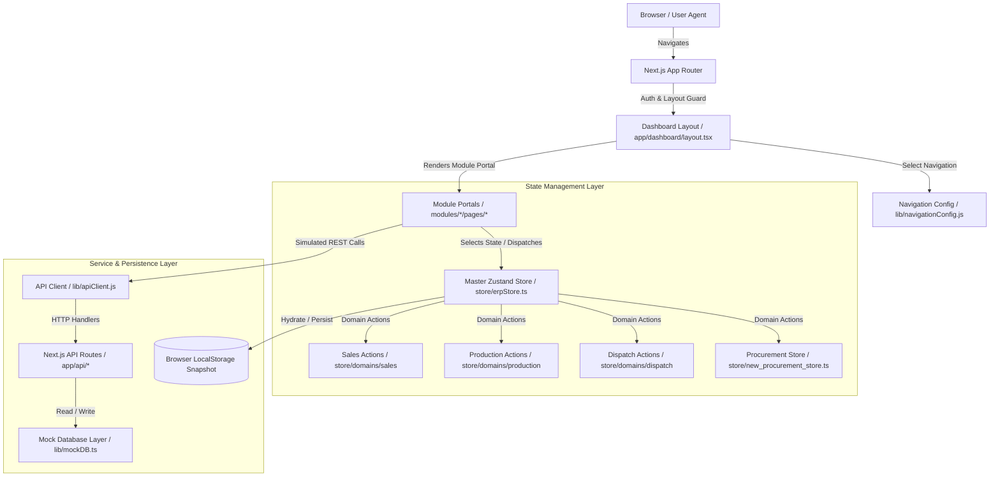
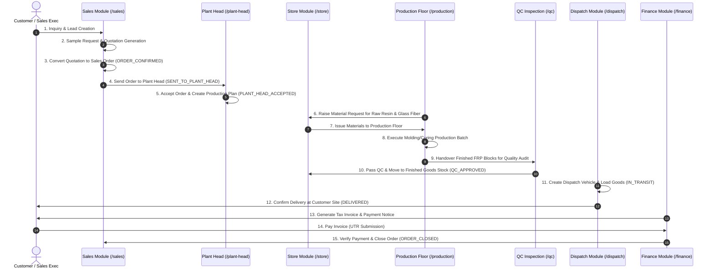
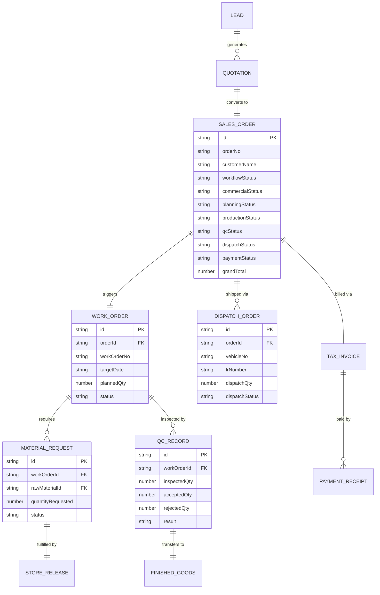
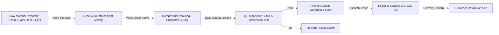
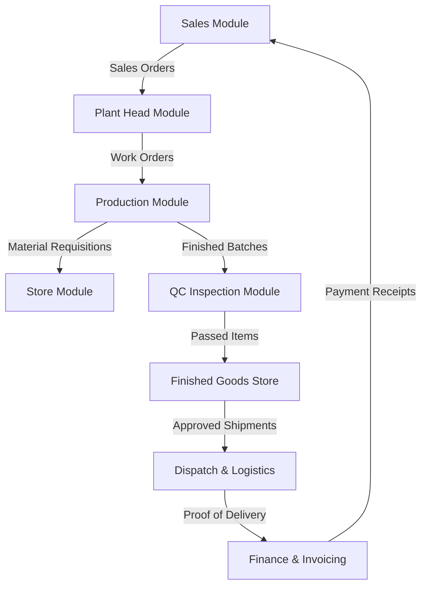

# Himalaya Next.js ERP System — Master Technical & Architectural Specification

> **Company:** Himalaya FRP & Construction Products  
> **Platform:** Next.js Enterprise Resource Planning (ERP) V2 Prototype  
> **Target Products:** FRP Cover Blocks, FRP Manhole Covers, FRP Gratings, FRP Structural Products  
> **Document Version:** 2.0.0 (Complete System Audit)

---

## 1. Executive Summary

The **Himalaya Next.js ERP System** is an integrated manufacturing management platform built specifically for Fiber-Reinforced Polymer (FRP) product manufacturing. The application covers the complete Order-to-Cash (O2C) lifecycle, Purchase-to-Pay (P2P) procurement, Production Floor Scheduling, Quality Assurance, Inventory Control, Logistics & Dispatch, HR & Payroll, and Financial Accounting.

### Core Architectural Paradigm
- **Framework:** Next.js 14+ (App Router architecture with dynamic client portals).
- **State Engine & Single Source of Truth:** Multi-domain Zustand architecture (`useERPStore`) with domain-driven actions (`store/domains/*`) and LocalStorage hydration persistence (`himalaya-erp-store`).
- **Data Persistence Mode:** Client-side reactive memory & LocalStorage snapshot state (`lib/mockDB.ts`, `lib/mockStorage.ts`) with simulated backend REST services (`services/*`, `lib/apiClient.js`).
- **User Interface:** Vanilla CSS tokens, glassmorphism dashboard themes, responsive grid layouts, and custom operational widgets (`components/*`).

---

## 2. System Architecture Diagram

The system follows a domain-driven Next.js layout where user requests route through Next.js dashboard wrappers into module-specific portals powered by Zustand state actions and domain event buses.



---

## 3. Comprehensive Folder Breakdown

```
c:\xampp\htdocs\prototype-next\
├── app/                        # Next.js App Router Structure
├── docs/                       # Comprehensive System Documentation & Business Flows
│   └── project-flows/          # Core Business Process Workflows
│       ├── README.md           # Master Flow Index
│       ├── 1_sales_order_flow.md    # Sales Order, Replacement & RMA Return Flow
│       ├── 2_material_request_flow.md # Internal Store & Production Requisition Flow
│       ├── 3_purchase_indent_flow.md  # Purchase Indent & Procure-to-Pay (P2P) Flow
│       └── 4_hr_salary_prep_flow.md   # HR Payroll & Attendance Cutoff Flow
│   ├── (dashboard)/            # Authenticated Dashboard Route Group
│   │   ├── admin/              # System & User Administration Views
│   │   ├── dispatch/           # Logistics & Shipping Management
│   │   ├── employee/           # Staff Portal
│   │   ├── finance/            # Financial & Procurement Control
│   │   ├── finance-executive/  # Payment Verification & Receipts
│   │   ├── hr/                 # Human Resources & Payroll
│   │   ├── orders/             # Master Order Management
│   │   ├── plant-head/         # Plant Operations & Capacity Planning
│   │   ├── production/         # Production Floor & Work Orders
│   │   ├── qc/                 # Quality Inspection & Testing
│   │   ├── sales/              # Sales, Leads, Quotations
│   │   ├── store/              # Raw Material Inventory & Issues
│   │   ├── super-admin/        # Executive Analytics & System Config
│   │   └── layout.tsx          # Shared Dashboard Navigation Shell
│   ├── api/                    # Next.js Server Route Handlers
│   │   ├── orders/             # Order Status Update API
│   │   ├── production/         # Work Order Action API
│   │   └── qc/                 # QC Approval & Rejection API
│   ├── login/                  # User Authentication Page
│   ├── globals.css             # Global CSS Design Tokens & Themes
│   └── layout.tsx              # Root HTML & Providers Wrapper
├── modules/                    # Feature Module Portals (Domain Modules)
│   ├── admin/                  # User, Role, Department Management
│   ├── dispatch/               # DispatchPortal.jsx & Logistics Views
│   ├── finance/                # FinancePortal.jsx & Invoice Management
│   ├── finance-executive/      # Payment Verification Portals
│   ├── hr/                     # HRPortal.jsx & Payroll Processing
│   ├── plant-head/             # PlantHeadPortal.jsx & Planning Board
│   ├── procurement/            # Purchase Order & Vendor Management
│   ├── production/             # ProductionPortal.jsx & Floor Operations
│   ├── qc/                     # QC Inspections & History
│   ├── sales/                  # SalesPortal.jsx & Quotation Engine
│   ├── store/                  # StorePortal.jsx & Material Issues
│   └── super-admin/            # SuperAdminPortal.jsx & Analytics
├── store/                      # Zustand State Management Core
│   ├── erpStore.ts             # Master Unified ERP Store (149KB)
│   ├── domains/                # Domain-Specific State & Actions
│   │   ├── sales/              # Sales State, Selectors, Actions
│   │   ├── production/         # Production Work Orders & QC State
│   │   ├── dispatch/           # Dispatch Tracking & Consignments
│   │   └── shared/             # Cross-Domain State Wrappers
│   ├── authStore.ts            # Active User Session & Role Storage
│   ├── new_procurement_store.ts# Procurement & Vendor Purchase Store
│   └── notificationStore.ts    # Global Toast & Alert Notification Queue
├── components/                 # Reusable UI Widgets & Modal Components
│   ├── CreateLead.jsx          # Lead Creation Modal
│   ├── CreateQuotation.jsx     # Quotation & Pricing Engine Modal
│   ├── CreateOrder.jsx         # Sales Order Creation Component
│   ├── OrdersView.jsx          # Order Summary & Status Card Grid
│   ├── OrderTimeline.jsx       # Order History Audit Trail Component
│   ├── PaymentFollowupERPView.jsx # Payment Collection Matrix
│   └── Sidebar.jsx             # Role-Based Sidebar Navigation
├── lib/                        # Utility Libraries & Configuration
│   ├── navigationConfig.js     # Master Role Navigation Registry
│   ├── routeConfig.js          # Role Dashboard Landing Page Map
│   ├── apiClient.js            # Simulated API Client Service Engine
│   └── mockData.ts             # Default Seed Data Snapshot
├── engine/                     # Business Logic Engine & Event Bus
│   ├── eventBus.js             # Real-time Component Event Pub/Sub
│   ├── database.js             # In-memory Local Storage Database Engine
│   └── orchestrators/          # Workflow Stage Orchestrators
├── services/                   # Service Layer Wrappers
│   ├── sales.service.js        # Lead/Quote/Order Operations
│   ├── production.service.js   # Work Order & Daily Output Ops
│   ├── dispatch.service.js     # Shipment & Challan Operations
│   ├── finance.service.js      # Invoice & Verification Ops
│   └── admin.service.js        # User & Audit Operations
└── types/                      # TypeScript Definitions
    └── Order.ts                # Master Order, Item, Timeline Models
```

---

## 4. User Roles & Responsibilities

The ERP system explicitly implements **11 active roles**. (The `Customer` role is referenced in requirements but is **Not Implemented** in the codebase).

| Role Name | Primary Responsibility | Permissions Summary | Main Accessible Pages | Database Tables Affected |
| :--- | :--- | :--- | :--- | :--- |
| **Super Admin** | Executive Overview, Analytics & System Config | Full system read/write, salary approvals, business analytics, logs | `/super-admin/*` | All Stores & Domains |
| **Admin** | System Maintenance & User RBAC | Manage users, roles, permissions, audit logs, system monitor | `/admin/*` | `users`, `roles`, `auditLogs` |
| **Sales** | Lead Generation, Quotes, & Sales Orders | Create leads, samples, quotes, confirm orders, log payments | `/sales/*` | `leads`, `samples`, `quotations`, `sales.orders` |
| **Plant Head** | Plant Capacity & Production Planning | Accept/Reject incoming orders, plan work orders, approve material indents | `/plant-head/*` | `sales.orders`, `workOrders`, `purchaseIndents` |
| **Production** | Manufacturing Floor Execution | Receive work orders, request raw materials, record daily production output | `/production/*` | `workOrders`, `materialRequests`, `finishedGoods` |
| **Store** | Raw Material & Finished Goods Inventory | Manage inventory stock, issue materials to floor, receive goods receipts | `/store/*` | `rawInventory`, `storeReleases`, `goodsReceipts` |
| **QC** | Quality Control & Product Inspection | Conduct dimensions, strength, and finish inspections; approve/fail batches | `/qc/*` | `qcInspections`, `qcRecords`, `reworkLogs` |
| **Dispatch** | Logistics & Order Shipping | Create vehicle dispatches, generate challans, track in-transit shipments | `/dispatch/*` | `dispatchOrders`, `consignments`, `deliveries` |
| **Finance** | Procurement Approvals & Invoicing | Approve POs, issue tax invoices, manage salary disbursement | `/finance/*` | `invoices`, `purchaseOrders`, `payroll` |
| **Finance Executive** | Payment Verification & Collection | Verify incoming customer payments, issue receipts, track overdue accounts | `/finance-executive/*` | `paymentConfirmations`, `receipts`, `sales.orders` |
| **HR** | Attendance & Staff Payroll Processing | Manage employees, shifts, leave requests, prepare monthly payroll | `/hr/*` | `employees`, `attendance`, `payrollBatches` |
| **Customer** | *Not Implemented* | *Not Implemented* | *Not Implemented* | *None* |

---

## 5. End-to-End ERP Business Workflow & Core Module Specifications

The core ERP platform connects customer acquisition, store transfers, procurement, production, quality control, dispatch, and HR payroll. Detailed process specifications are stored in [`docs/project-flows/`](file:///d:/prototype-next-main/docs/project-flows/README.md).

### Master Sequence Diagram: FRP Order-to-Cash (O2C)



---

### Detailed Breakdown of the 4 Core Business Process Flows

#### 1. [Sales Order, Replacement & Return Flow](file:///d:/prototype-next-main/docs/project-flows/1_sales_order_flow.md)
* **Lead to Order**: Customer Inquiry $\rightarrow$ Sample Request & Trial Dispatch $\rightarrow$ Quotation & Proforma Invoice (PI) $\rightarrow$ Sales Order Creation & Credit Limit Check $\rightarrow$ Order Approval.
* **Fulfillment & Dispatch**: Warehouse Picking $\rightarrow$ Packing & Delivery Note $\rightarrow$ Vehicle Loading & Security Gate Pass $\rightarrow$ Tax Invoice & E-Way Bill generation.
* **Return Order (RMA)**: Customer Complaint $\rightarrow$ RMA Authorization $\rightarrow$ Inward Security Gate Entry $\rightarrow$ QC Audit (Restock vs Scrap Store) $\rightarrow$ Financial Credit Note.
* **Replacement Order**: RMA Linkage $\rightarrow$ Zero-Value Replacement Sales Order Creation $\rightarrow$ Warehouse Picking $\rightarrow$ Dispatch $\rightarrow$ Customer POD Sign-off.

#### 2. [Material Request Flow](file:///d:/prototype-next-main/docs/project-flows/2_material_request_flow.md)
* **Requisition Entry**: Shopfloor / Maintenance requirement logged in ERP linked to a Production Work Order.
* **HOD Approval**: Department Head verifies BOM quantity and approves request.
* **Store Verification & Auto-Indent**: Storekeeper checks Main Warehouse stock. If stock is sufficient, system soft-reserves items. If stock is short, system **auto-generates a Purchase Indent** for the deficit.
* **Material Issue & Acknowledgment**: Storekeeper issues material via Material Issue Slip (MIS). Shopfloor handler acknowledges receipt via ERP, updating WIP inventory and costing.

#### 3. [Purchase Indent & Material Flow (P2P)](file:///d:/prototype-next-main/docs/project-flows/3_purchase_indent_flow.md)
* **Indent Requisition & Approval**: Requisition triggered manually or via Min-Max Reorder/MRP $\rightarrow$ Routes through budget approval hierarchy (HOD $\rightarrow$ Plant Head $\rightarrow$ Finance).
* **RFQ & Vendor Selection**: RFQ issued to suppliers $\rightarrow$ Commercial Comparison Matrix (CS Statement) generated $\rightarrow$ Best vendor approved.
* **Purchase Order (PO) & Inward Receipt**: PO issued to vendor $\rightarrow$ Vendor dispatches shipment $\rightarrow$ Security Gate Entry created $\rightarrow$ Unloaded into Quarantine Holding Store.
* **Quality Inspection (QC) & GRN**: QC tests physical samples (Accepted Qty vs Rejected Qty/Debit Note) $\rightarrow$ Storekeeper creates Goods Receipt Note (GRN) for passed items $\rightarrow$ Accounts Payable runs **3-Way Matching** (PO vs GRN vs Vendor Bill) before payment.

#### 4. [HR Salary Preparation & Payroll Flow](file:///d:/prototype-next-main/docs/project-flows/4_hr_salary_prep_flow.md)
* **Attendance Sync & Cutoff**: Biometric punch sync $\rightarrow$ Leave & Overtime regularization $\rightarrow$ Monthly Attendance Cutoff Freeze on 25th of month $\rightarrow$ Loss of Pay (LWP) calculation.
* **Salary Computation Engine**: Pro-rated Gross Salary (Basic, HRA, Allowances) $\rightarrow$ Statutory Deductions (PF 12%, ESI 0.75%, PT, TDS) $\rightarrow$ Loan recovery EMI.
* **Approvals & Disbursement**: HR Manager audit $\rightarrow$ Finance Director / MD approval $\rightarrow$ NACH/NEFT Bank Payment Batch export $\rightarrow$ Corporate bank transfer execution $\rightarrow$ Digital Payslip delivery on ESS portal.

---

## 6. Page Navigation & Route Map

| Route | Purpose | Allowed Roles | Connected Store / Action | Output State |
| :--- | :--- | :--- | :--- | :--- |
| `/login` | User Authentication | Public | `useAuthStore.login` | Session token & role redirect |
| `/sales/dashboard` | Sales Performance KPI Summary | Sales, Admin, Super Admin | `useERPStore (state.sales)` | Visual pipeline metrics |
| `/sales/leads` | Lead Management & Conversion | Sales | `createLead`, `updateLeadStatus` | `state.sales.leads` update |
| `/sales/quotations` | Quotation Generation Engine | Sales | `createQuotation`, `convertQuotation` | `state.sales.quotations` update |
| `/sales/orders` | Active Sales Order Tracker | Sales | `convertQuotationToOrder` | `state.sales.orders` status view |
| `/plant-head/dashboard` | Operations & Capacity Overview | Plant Head, Super Admin | `useERPStore` | Plant utilization metrics |
| `/plant-head/incoming-orders` | Accept/Reject Incoming Sales Orders | Plant Head | `acceptOrderByPlantHead` | `planningStatus: PLANT_HEAD_ACCEPTED` |
| `/plant-head/planning` | Work Order Production Planner | Plant Head | `planOrder` | Linked `WorkOrder` created |
| `/production/dashboard` | Manufacturing Floor Summary | Production | `useERPStore` | Daily output statistics |
| `/production/work-orders` | Production Work Order List | Production | `activateWorkOrder` | Active floor job cards |
| `/production/material-requests` | Request Raw Materials from Store | Production | `createMaterialRequest` | `materialRequests` array |
| `/store/raw-inventory` | Raw Inventory Stock Tracking | Store, Plant Head | `updateStockLevel` | Stock ledger quantities |
| `/store/material-requests` | Fulfill Material Requests | Store | `approveStoreRelease` | Stock deduction & store release |
| `/qc/pending` | Inspection Queue for Batches | QC | `useERPStore` | Pending QA batch list |
| `/qc/history` | Historical Inspection Records | QC | `approveQC`, `rejectQC` | `qcRecords` audit record |
| `/dispatch/orders` | Create Vehicle Shipment | Dispatch | `createDispatch` | Consignment challan & status `IN_TRANSIT` |
| `/dispatch/delivery` | Confirm Goods Receipt | Dispatch | `confirmDelivery` | Order status updated to `DELIVERED` |
| `/finance/invoices` | Customer Invoice Processing | Finance | `generateInvoice` | Printable Tax Invoice |
| `/finance/payment-verification` | Verify UTR & Bank Transfers | Finance, Finance Executive | `verifyFinancePayment` | Order payment status `FULLY_PAID` |
| `/hr/dashboard` | Employee & Attendance Overview | HR | `useERPStore` | Staff attendance overview |
| `/hr/salary/prepare` | Monthly Payroll Calculator | HR | `calculatePayrollBatch` | `payrollBatches` summary |
| `/super-admin/dashboard` | Executive KPI Control Center | Super Admin | All domain stores | Multi-department executive view |

---

## 7. API Route Documentation

The application features API endpoints defined under `app/api/*` and helper REST services in `lib/apiClient.js` and `services/*`.

### Endpoint Detail Table

| Method | Endpoint Route | Purpose | Input Payload | Database / State Operations | Output Response |
| :--- | :--- | :--- | :--- | :--- | :--- |
| `PATCH` | `/api/orders` | Update Master Order Workflow Status | `{ orderId, status, notes, actor }` | Mutates `state.sales.orders`, appends `history` event | `{ success: true, order }` |
| `POST` | `/api/production` | Create or Activate Work Order | `{ orderId, plannedQty, machine, shift }` | Creates `workOrders` entry, sets `productionStatus` | `{ success: true, workOrder }` |
| `POST` | `/api/qc` | Log Quality Inspection Result | `{ orderId, acceptedQty, rejectedQty, defects }` | Appends `qcRecords`, updates order `qcStatus` | `{ success: true, qcRecord }` |
| `POST` | `/api/dispatch` | Generate Dispatch & Challan | `{ orderId, vehicleNo, driverName, dispatchQty }` | Creates `dispatchOrders`, sets status `IN_TRANSIT` | `{ success: true, dispatch }` |
| `POST` | `/api/finance/verify-payment` | Verify Customer Payment Receipt | `{ orderId, utrNumber, amount }` | Updates `paymentStatus`, triggers invoice closure | `{ success: true, verified: true }` |

---

## 8. Database Schema Models & Entity-Relationship Diagram (ERD)

Although no SQL server is connected in this prototype, the state schema strictly follows entity-relational principles.



---

## 9. Authentication & Authorization Architecture

### Authentication Mechanism
1. User enters credentials at `/login`.
2. `LoginPage` maps email prefix (e.g., `plant@himalayaerp.com`) to a predefined `UserRole` (`Plant Head`).
3. Store action `useAuthStore.getState().login(role, user)` commits the authenticated state to LocalStorage (`auth-storage`).
4. User is redirected to their role landing page defined in `DASHBOARD_REDIRECTS` in `lib/routeConfig.js`.

### Authorization Security Flow
1. Root dashboard layout (`app/(dashboard)/layout.tsx`) reads active role from `useAuthStore`.
2. Navigation items are filtered via `getNavigationForPath(pathname, role)` in `config/navigationHelpers.js`.
3. If an unauthenticated user or an unauthorized role navigates to a restricted route, the layout enforces client-side route redirection back to `/login` or their authorized dashboard.

---

## 10. Master Authorization Matrix

| Page / API / Module | Admin | Super Admin | Sales | Plant Head | Production | Store | QC | Dispatch | Finance | HR |
| :--- | :---: | :---: | :---: | :---: | :---: | :---: | :---: | :---: | :---: | :---: |
| `/sales/*` | ⚠ | ✅ | ✅ | ❌ | ❌ | ❌ | ❌ | ❌ | ❌ | ❌ |
| `/plant-head/*` | ⚠ | ✅ | ❌ | ✅ | ❌ | ❌ | ❌ | ❌ | ❌ | ❌ |
| `/production/*` | ⚠ | ✅ | ❌ | ⚠ | ✅ | ❌ | ❌ | ❌ | ❌ | ❌ |
| `/store/*` | ⚠ | ✅ | ❌ | ⚠ | ❌ | ✅ | ❌ | ❌ | ❌ | ❌ |
| `/qc/*` | ⚠ | ✅ | ❌ | ❌ | ❌ | ❌ | ✅ | ❌ | ❌ | ❌ |
| `/dispatch/*` | ⚠ | ✅ | ❌ | ❌ | ❌ | ❌ | ❌ | ✅ | ❌ | ❌ |
| `/finance/*` | ⚠ | ✅ | ❌ | ❌ | ❌ | ❌ | ❌ | ❌ | ✅ | ❌ |
| `/hr/*` | ⚠ | ✅ | ❌ | ❌ | ❌ | ❌ | ❌ | ❌ | ❌ | ✅ |
| `/admin/*` | ✅ | ✅ | ❌ | ❌ | ❌ | ❌ | ❌ | ❌ | ❌ | ❌ |
| `/super-admin/*` | ❌ | ✅ | ❌ | ❌ | ❌ | ❌ | ❌ | ❌ | ❌ | ❌ |
| `PATCH /api/orders` | ✅ | ✅ | ✅ | ✅ | ❌ | ❌ | ❌ | ❌ | ❌ | ❌ |
| `POST /api/qc` | ✅ | ✅ | ❌ | ❌ | ❌ | ❌ | ✅ | ❌ | ❌ | ❌ |

*(Legend: `✅ Allowed` | `❌ Forbidden` | `⚠ Partial / Read-only`)*

---

## 11. Role-Based User Journeys

### 1. Sales Executive Journey
```
Login (/login) 
  ↳ Dashboard (/sales/dashboard) 
  ↳ Create Lead (/sales/leads) 
  ↳ Issue Sample Request (/sales/samples) 
  ↳ Generate Quotation (/sales/quotations) 
  ↳ Confirm Sales Order (/sales/orders) 
  ↳ Monitor Production Status (/sales/production-status) 
  ↳ Payment Follow-up (/sales/payment-followup) 
  ↳ Logout
```

### 2. Plant Head Journey
```
Login (/login) 
  ↳ Operations Dashboard (/plant-head/dashboard) 
  ↳ View Incoming Orders (/plant-head/incoming-orders) 
  ↳ Accept Order & Plan Machine Shift (/plant-head/planning) 
  ↳ Approve Material Indents (/plant-head/material-approvals) 
  ↳ Review Production Analytics (/plant-head/production-analytics) 
  ↳ Logout
```

### 3. Production Floor Manager Journey
```
Login (/login) 
  ↳ Floor Dashboard (/production/dashboard) 
  ↳ Open Work Orders (/production/work-orders) 
  ↳ Raise Resin/Fiber Request (/production/material-requests) 
  ↳ Record Daily Molded Output (/production/production-work) 
  ↳ Handover Batch to QC (/production/testing) 
  ↳ Logout
```

---

## 12. FRP Manufacturing Journey (Raw Material to Customer Site)



---

## 13. Module Dependency Matrix



---

## 14. Missing Modules & Production Gaps

The analysis identified the following missing elements required for full enterprise production readiness:

1. **Database ORM & Persistence Layer:**
   - *Current State:* Data is stored in Zustand state and LocalStorage (`himalaya-erp-store`).
   - *Missing:* PostgreSQL/MySQL database schema, Prisma/Drizzle ORM migration scripts.
2. **Server-Side Authentication & Session Tokens:**
   - *Current State:* Authentication is simulated via client-side Zustand store setters (`authStore.ts`).
   - *Missing:* NextAuth.js/JWT HttpOnly cookie authentication, bcrypt password hashing.
3. **Database Transactional Integrity (ACID):**
   - *Current State:* Material release and stock deduction happen in separated client actions.
   - *Missing:* Server-side database transactions (`prisma.$transaction`) to prevent inventory race conditions.
4. **General Ledger & Double-Entry Accounting:**
   - *Current State:* Basic payment verification and invoice list view.
   - *Missing:* Chart of accounts, debit/credit ledger journals, automated GST return generation.
5. **Customer Portal:**
   - *Current State:* Customer role is non-existent in authentication handlers.
   - *Missing:* External client self-service portal for tracking order status and downloading invoices.

---

## 15. Roadmap & Suggestions for Production Readiness

1. **Implement PostgreSQL + Prisma ORM:** Migrate Zustand initial states into structured SQL tables with foreign key constraints.
2. **Deploy NextAuth.js / JWT:** Replace mock client authentication with server-side session checks and middleware route guards (`middleware.ts`).
3. **Enforce Transactional Material Releases:** Wrap raw inventory deductions and store releases inside server-side database transactions.
4. **Integrate Real-Time WebSockets:** Implement Pusher or Socket.io for real-time production floor updates to the Plant Head dashboard.
5. **Connect ERP Accounting Module:** Expand Finance portal to support Automated GST Invoicing (E-Invoicing API integration) and Tally/Zoho Sync.
